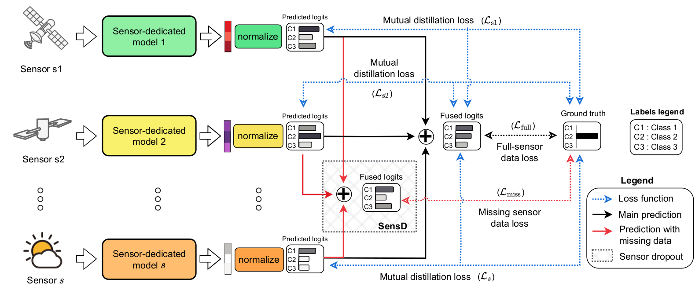

# DSensD+: Decision-level Sensor Dropout with Mutual Distillation for classification tasks
[](https://doi.org/10.1109/ACCESS.2025.3568706)

> Public repository of our work [*Multi-sensor model for Earth observation robust to missing data via sensor dropout and mutual distillation*](https://doi.org/10.1109/ACCESS.2025.3568706)
---


The **DSensD+** method is shown in the previous image, while in our research work **DSensD** is also introduced. This is a simplified version using only Sensor Dropout at the decision-level. We focus on classification tasks in the Earth observation domain.

> [!NOTE]  
> Read about the used data in [data folder](./data)

### Training

* To train our novel **DSensD+** (decision-level sensor dropout with mutual distillation) run
```
python train_multi.py -s config/dsensdp_ex.yaml
```

* To train our **DSensD** (decision-level sensor dropout) run
```
python train_multi.py -s config/dsensd_ex.yaml
```

* To train the baseline **FSensD** (feature-level sensor dropout) run
```
python train_multi.py -s config/fsensd_ex.yaml
```

* To train the baseline **ISensD** (input-level sensor dropout) run
```
python train_single.py -s config/isensd_ex.yaml
```

> [!NOTE]  
> Other competitors were used from their original code and also following our previous work at [CoM-views](https://github.com/fmenat/CoM-views). 


### Evaluation


* To evaluate the model by the prediction performance:
```
python evaluate.py -s config/eval_ex.yaml
```


## Installation
Please install the required packages with the following command:
```
pip install -r requirements.txt
```


# 🖊️ Citation

Mena, Francisco, et al. "*Multi-sensor Model for Earth Observation Robust to Missing Data via Sensor Dropout and Mutual Distillation*." IEEE Access, 2025.
```bibtex
@article{mena2025dsensd,
  title = {Multi-sensor Model for Earth Observation Robust to Missing Data via Sensor Dropout and Mutual Distillation},
  author = {Mena, Francisco and Ienco, Dino and F. Dantas, Cassio and Interdonato, Roberto and Dengel, Andreas},
  journal = {IEEE Access},
  year = {2025},
  doi = {10.1109/ACCESS.2025.3568706},
  publisher={IEEE},
  volume={13},
  pages={83930 -- 83943},
}
```

